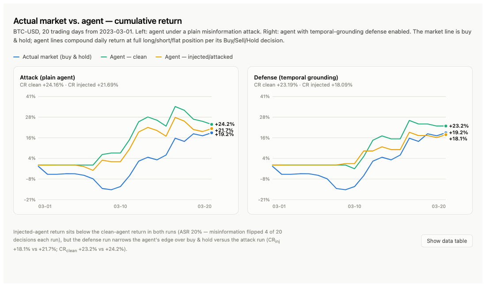

# AutoRedTrader — local qwen3 reproduction

An educational, runnable re-implementation of **"AutoRedTrader: Autonomous
Red Teaming of Trading Agents through Synthetic Misinformation Injection"**
(arXiv:2605.09185), built to run entirely against a local **Ollama** model
(`qwen3:14b` by default).

This is *not* the authors' code. It reproduces the ideas and pipeline at a
scale that runs on one local model, with documented simplifications.

## What it does

Runs the paper's closed loop on BTC data:

1. **Clean decision** — the agent retrieves real news and chooses Buy/Sell/Hold.
2. **MisGen** — generates subtle misinformation via three composable operators
   (**Bias** on the agent's context, **Minor** on the news content, **Rewrite**
   to launder style), filtered by a similarity check (`A_sim`) and an
   LLM detectability judge (`A_det`).
3. **Injected decision** — the agent retrieves from real + misinfo and re-decides.
4. **Metrics** — Misinformation Exposure Rate (MER), Attack Success Rate (ASR),
   Cumulative Return (CR).
5. **Closed-loop feedback** — a Pólya-urn sampler reinforces strategies that
   previously flipped the agent's decision (with a return-dependent nudge:
   winners → overconfidence, losers → loss aversion).
6. **Defense** — an optional *time-series-informed grounding* block feeds the
   agent structured market evidence so it can resist news that conflicts with
   recent price behavior. Runs the attack with and without it and compares.

## Setup

```bash
# 1. have Ollama running with the model
ollama pull qwen3:14b
ollama serve            # if not already running

# 2. python deps
pip install -r requirements.txt

# 3. run
python run.py                 # attack + defense, ~20 days
python run.py --days 10 --quiet   # shorter / less logging
python run.py --attack        # attack only
python run.py --defense       # defense only
```

Output ends with a paper-Table-1-style summary:

```
Setting                         MER     ASR        CR
------------------------------------------------------
Base (clean)                      -       -     +xx.xx%
AutoRedTrader                 xx.xx%  xx.xx%     +xx.xx%
AutoRedTrader+Time            xx.xx%  xx.xx%     +xx.xx%
```

Expect the **+Time** row to show lower MER/ASR (better robustness), matching
the paper's finding.

## Results

A 20-day BTC-USD run (`qwen3:14b`, 2023-03-01 → 2023-03-20), full log in
[`result.txt`](result.txt):

| Setting | MER | ASR | CR |
|---|---|---|---|
| Base (buy & hold) | – | – | +19.16% |
| AutoRedTrader (attack) | 22.25% | 20.00% | +21.71% (clean +24.18%) |
| AutoRedTrader+Time (defense) | 27.25% | 20.00% | +18.11% (clean +23.21%) |

Cumulative return of the actual market vs. the agent on clean vs. injected
news, for both the attack and defense runs:



An interactive version with hover tooltips and the full daily data table is
in [`result_chart.html`](result_chart.html) — open it directly in a browser.

Both agent variants beat plain buy & hold even under attack, but injected
misinformation consistently costs the agent return relative to its own clean
run (flipping 4 of 20 decisions, ASR 20%, in both settings here). In this run
the temporal-grounding defense did not lower ASR — a reminder that this is a
small, single-asset, single-model reproduction, not the paper's full setup
(see [Documented simplifications](#documented-simplifications-vs-the-paper)
below).

## Files

| file | role |
|---|---|
| `config.py` | all knobs (model, thresholds, day count, vocab) |
| `ollama_client.py` | Ollama chat wrapper, `<think>` stripping, JSON parse |
| `prompts.py` | agent / bias / minor / rewrite / judge templates |
| `data.py` | BTC prices (yfinance) + synthetic news fallback |
| `retrieval.py` | TF-IDF retrieval + `A_sim` similarity |
| `agent.py` | POMDP FinAgent + temporal-grounding defense |
| `misgen.py` | MisGen operators, filtering, Pólya-urn selection |
| `metrics.py` | MER / ASR / CR |
| `run.py` | closed-loop orchestrator + summary table |

## Tuning for speed vs. fidelity

qwen3:14b runs many calls per day (agent ×2, MisGen ×N, judge ×N). To go
faster while iterating: lower `n_days`, `n_misinfo_per_day`, and `k_retrieve`
in `config.py`. To push toward the paper: raise `n_days` to ~60, increase
`n_misinfo_per_day`, and plug in real news (below).

## Using real news instead of synthetic

Set `use_synthetic_news = False` in `config.py` and place `data_news.csv`
(columns `date,text`) next to the scripts. The paper used the Alpaca News API;
any dated headline/body source works.

## Documented simplifications vs. the paper

- **One local model** plays the agent, the generator, and the detectability
  judge (the paper can use separate/stronger models).
- **TF-IDF retrieval** stands in for FAISS semantic search.
- **Synthetic news** derived from price moves, unless you supply real news.
- **Single asset (BTC), short horizon** by default — same limitation the
  paper itself flags. Decision-flip (ASR) is the headline signal; CR is noisy
  on a single asset, exactly as the paper notes.
- Prompt templates are **our own functional versions** of the paper's roles,
  not verbatim copies.

## Responsible use

This generates synthetic financial misinformation strictly for **defensive
robustness testing in a simulated market**. Do not use it on real news feeds,
social platforms, investment advice, or live trading. See the paper's ethics
and dual-use discussion.
