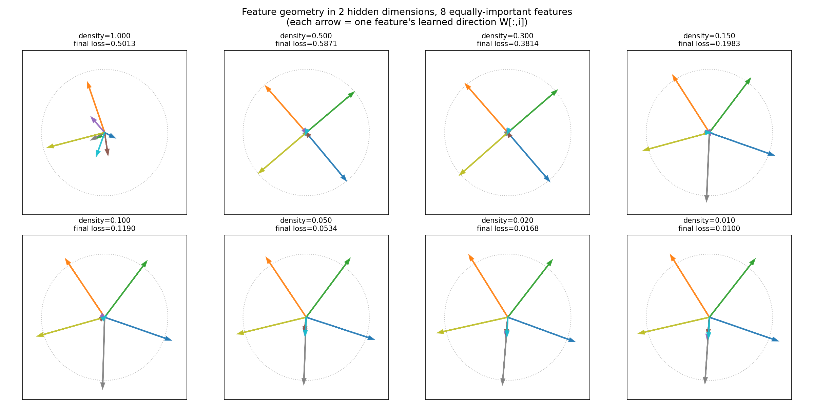
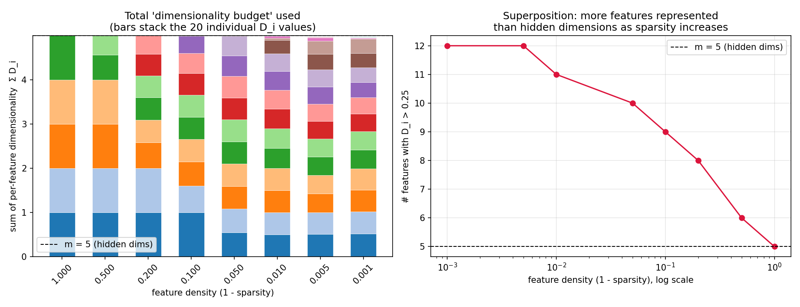
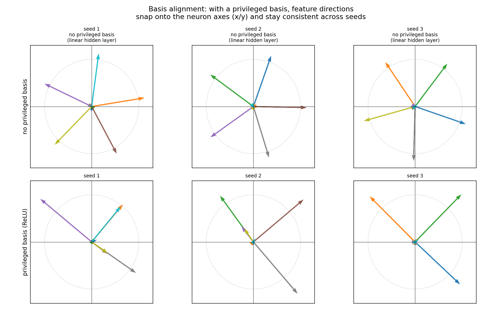

# Toy Models of Superposition — a from-scratch replication

A ~250-line NumPy-only reproduction of the core experiments from Anthropic's
[*Toy Models of Superposition*](https://transformer-circuits.pub/2022/toy_model/index.html)
(Elhage et al., 2022) — the paper that explains why neural networks can represent
*more features than they have dimensions*, and why that makes interpretability hard.

No PyTorch, no GPU, no downloaded datasets. Everything — model, training loop,
and gradients — is implemented by hand in plain NumPy, because the whole point
of the original paper is that this phenomenon shows up in the simplest possible
setting: a two-layer network reconstructing sparse synthetic data.

<p align="center">
  
</p>

## Why superposition matters

If a network only ever represented as many features as it has neurons, each
neuron would (in principle) correspond to one interpretable concept. Real
networks don't work that way — they pack in far more concepts than they have
dimensions, by exploiting the fact that most concepts are *sparse* (rarely
active at the same time) and can share space if their directions rarely
interfere. This is a big part of why individual neurons in real models don't
map cleanly onto human-understandable ideas, and it's the motivating problem
for most of modern mechanistic interpretability.

This repo builds the smallest possible model that exhibits the phenomenon,
so you can watch it happen and check the paper's claims yourself.

## The model

```
h    = W @ x                (m,)   compress n features into m < n dimensions
out  = relu(Wᵀ @ h + b)     (n,)   reconstruct
loss = Σᵢ Iᵢ · (xᵢ − outᵢ)²         importance-weighted MSE
```

Each input feature `xᵢ` is independently zero with probability `sparsity`,
otherwise drawn from `Uniform(0, 1)`. Tied weights (encoder = decoderᵀ) and a
ReLU output are the same architecture used in the original paper.

## The four properties, and what I found

The paper frames interpretability around four properties a network's
representations might or might not have. Each is tested by a dedicated script:

| Property | Question | Script | Result |
|---|---|---|---|
| **Linearity** | Are features straight-line directions in activation space? | `run_four_properties.py` | ✅ Confirmed exactly — activation scales perfectly linearly with feature value (max deviation: 0.00). |
| **Decomposability** | Can activations be unpacked back into independent features? | `run_four_properties.py` | ✅ Sparse recovery (matching pursuit) accuracy rises from **0.22 → 0.67** as density drops from 1.0 → 0.001. |
| **Superposition** | Are more features packed in than there are dimensions? | `run_dimensionality_experiment.py`, `run_feature_geometry_2d.py` | ✅ With m=5 hidden dims, the model represents up to **12 of 20 features** at high sparsity, vs. exactly 5 with no sparsity. |
| **Basis-alignment** | Do feature directions line up with individual neurons? | `run_four_properties.py` | ⚠️ Inconclusive with this simple probe — see [Caveats](#caveats). |

## Results

**Superposition emerges smoothly as sparsity increases.** At density 1.0 (no
sparsity) the model behaves like PCA and only bothers representing 5 features
— exactly `m`. As density drops to 0.001, that climbs to 12, more than double
the hidden dimension count, while the total "dimensionality budget" (Σ Dᵢ)
stays conserved at ~m throughout — it's just divided up differently.

<p align="center">
  
</p>

**Feature geometry turns visibly non-orthogonal under superposition.** With
only 2 hidden dimensions and 8 equally-important features, dense inputs
collapse onto ~2 orthogonal directions (the rest get suppressed). As sparsity
increases, the network spreads features into symmetric non-orthogonal
arrangements — antipodal pairs, evenly-spaced configurations — matching the
polygon/tegum-product geometry reported in the original paper, with no
geometric constraint imposed by hand.

**Decomposability tracks sparsity directly**, which is the mechanistic reason
superposition doesn't just destroy interpretability: a crude matching-pursuit
decoder recovers which features were active far more reliably as inputs get
sparser (0.22 → 0.67 accuracy, see table above).

<p align="center">
  
</p>

## Quickstart

```bash
git clone <this-repo>
cd toy-models-superposition
pip install -r requirements.txt
bash run_all.sh
```

Figures land in `results/`. Total runtime: well under a minute on CPU.

## Repo structure

```
superposition.py                  core model: train(), feature_dimensionality(), batch generator
run_dimensionality_experiment.py  "dimensionality budget" plot: per-feature D_i vs. sparsity
run_feature_geometry_2d.py        2D visualization of learned feature directions ("polygon" figure)
run_four_properties.py            linearity probe, sparse-recovery test, privileged-basis comparison
results/                          generated figures
```

## Caveats

- This is a personal reimplementation for learning/demonstration purposes,
  not the original paper's code — exact hyperparameters and results will
  differ, and it hasn't been checked against the original at more than a
  qualitative level.
- The basis-alignment experiment (ReLU vs. linear hidden layer) did **not**
  cleanly confirm the expected effect at this scale. Adding a ReLU to the
  hidden layer also restricts it to the non-negative orthant, which reshapes
  the whole optimization landscape rather than cleanly adding an
  axis-alignment preference. Left in as an honest negative result — a
  cleaner test would likely need correlated feature structure and more
  neurons, closer to the original paper's setup.
- No internet or GPU was used or needed — everything is synthetic data
  trained from scratch.

## Reference

Elhage, N., Hume, T., Olsson, C., et al. (2022). *Toy Models of Superposition*.
Transformer Circuits Thread, Anthropic. https://transformer-circuits.pub/2022/toy_model/index.html
